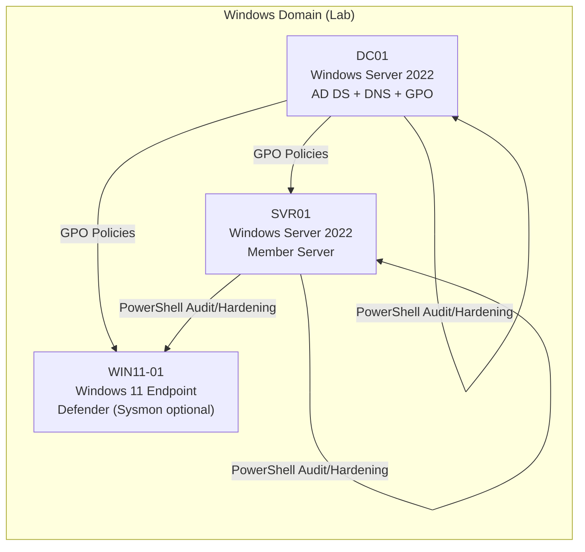

# Architecture (Windows Vulnerability Management & Hardening Lab)

## 1. Purpose
This lab simulates an enterprise Windows environment to practice a full vulnerability management lifecycle:
baseline assessment, risk-based prioritization, remediation planning, hardening implementation, and verification.

The architecture is intentionally small but mirrors real operational patterns:
- Centralized policy enforcement (GPO)
- Standardized security baselines (PowerShell/GPO)
- Evidence-driven auditing (before/after reports)
- Clear asset roles and criticality

---

## 2. Logical Topology

3. Components and Roles
3.1 DC01 — Domain Controller (Tier 0)

Role: Core identity and policy control plane.
Services:

Active Directory Domain Services (AD DS)

DNS

Group Policy Management (GPO)

Security relevance:

Highest criticality asset (Criticality = 5)

Primary target in enterprise environments

Hardening focuses on authentication policies, privileged access, and baseline security configuration

3.2 SVR01 — Member Server (Tier 1)

Role: Typical server workload host (file/app/web optional).
Services (optional):

IIS (for realism)

File services

Security relevance:

High-value lateral movement target

Hardening focuses on removing legacy services (e.g., SMBv1), enforcing firewall profiles, and restricting remote access paths

3.3 WIN11-01 — Endpoint (Tier 2)

Role: User workstation simulation.
Security controls:

Microsoft Defender Antivirus

Windows Firewall

Optional telemetry:

Sysmon for enhanced event visibility

Security relevance:

Common initial access vector in enterprise incidents

Hardening focuses on endpoint protection baseline and reducing local admin exposure

4. Data Flow and Control Flow
4.1 Control Flow (Enforcement)

GPO (DC01) applies security baselines across domain-joined machines (SVR01, WIN11-01).

PowerShell scripts apply and validate hardening controls, enabling repeatable execution and consistency.

4.2 Evidence Flow (Auditing)

audit.ps1 collects baseline evidence and exports JSON reports.

verify.ps1 collects post-remediation evidence and enables before/after comparison.

Findings are documented in markdown with supporting evidence stored in findings/reports/ and screenshots/.

5. Security Boundaries and Assumptions
5.1 Boundaries

All hosts are part of a lab domain environment.

Administrative actions (scripts) are executed with local/admin privileges where required.

The architecture assumes an internal network (non-internet-facing) unless exposure is explicitly configured.

5.2 Assumptions

Domain join is configured for SVR01 and WIN11-01.

Defender is available on endpoint and server (where supported).

Hardening actions are designed to be safe defaults, but should be reviewed before applying in production.
