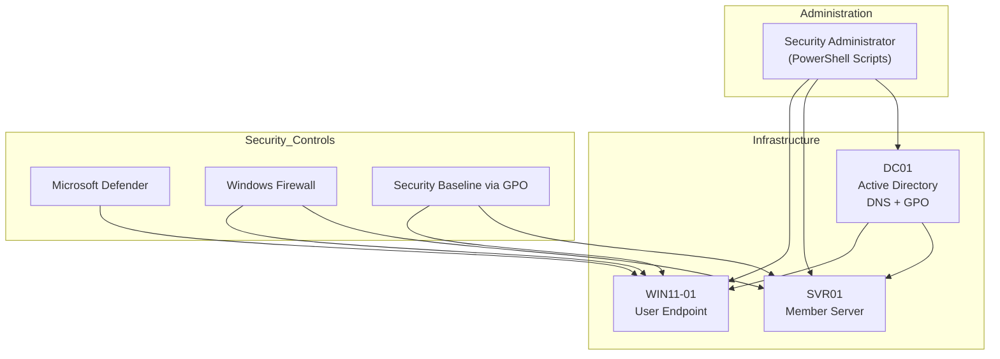
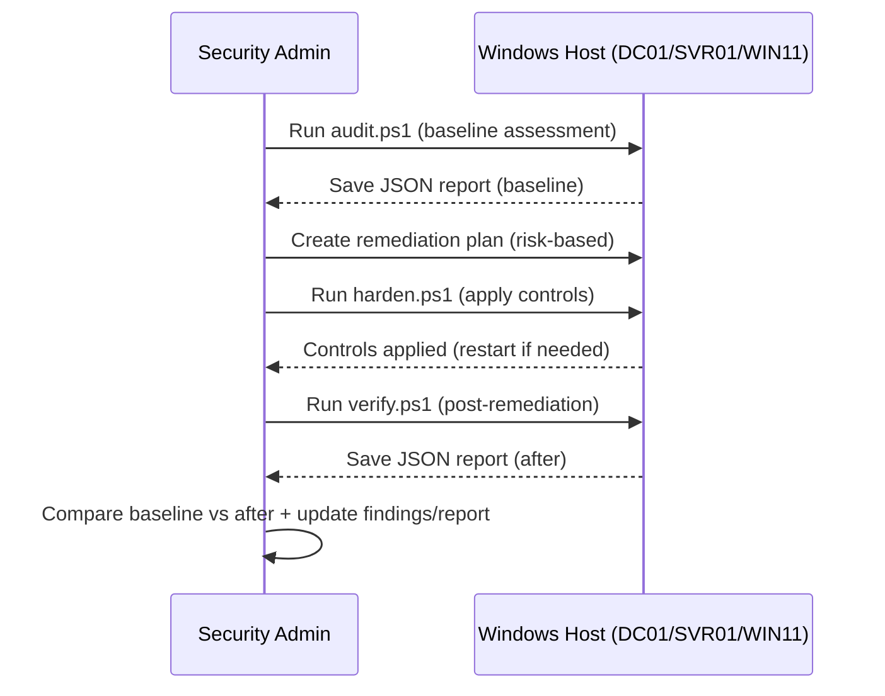

# Architecture (Enterprise Windows Vulnerability Management & Hardening Lab)

## 1. Purpose
This lab simulates a realistic Windows enterprise environment to practice:
- Vulnerability and configuration assessments
- Risk-based prioritization
- Remediation planning
- System hardening (PowerShell + GPO-aligned baseline)
- Post-remediation verification with evidence

The architecture is intentionally small but mirrors how security teams manage Windows environments at scale.

---

## 2. Scope (Windows-only)
**In-scope systems**
- Windows Server (Domain Controller)
- Windows Server (Member Server)
- Windows 10/11 Endpoint (Domain-joined)

**In-scope controls**
- Group Policy security baselines (documented / optionally enforced)
- Windows Firewall configuration
- Microsoft Defender baseline
- Protocol hardening (e.g., SMBv1 removal)
- Remote access hardening (RDP NLA when applicable)

---

## 3. Components & Roles

### 3.1 DC01 — Domain Controller (Tier 0)
**Role:** Identity and policy control plane.  
**Key services:**
- Active Directory Domain Services (AD DS)
- DNS
- Group Policy Objects (GPO)

**Why it matters:** The DC is the highest-value Windows asset in most environments, so it is treated as **highest criticality**.

---

### 3.2 SVR01 — Member Server (Tier 1)
**Role:** Represents a typical Windows server workload (app/file/web optional).  
**Why it matters:** Common lateral movement target; must follow secure baselines (protocols, firewall, access control).

---

### 3.3 WIN11-01 — Endpoint (Tier 2)
**Role:** Represents a user workstation.  
**Key controls:**
- Microsoft Defender Antivirus
- Windows Firewall
- Optional: Sysmon for additional telemetry

**Why it matters:** Endpoints are frequent initial access points and must be hardened consistently.

---

### 3.4 Administrative Role (Security Admin)
**Role:** Executes the security lifecycle using scripted automation:
- `audit.ps1` (baseline posture)
- `harden.ps1` (apply controls)
- `verify.ps1` (post-remediation validation)

This reflects real security engineering practice: standardization, repeatability, and evidence collection.

---

## 4. Logical Topology

### 4.1 Infrastructure + Controls (Clear View)



How to read it

DC01 centrally manages identity and policy.

GPO baseline represents centralized enforcement (password policies, firewall policies, audit policy, etc.).

Defender + Firewall represent endpoint and host protections.

Admin scripts represent assessment, enforcement, and verification activities.

5. Data Flow: Assessment → Hardening → Verification
5.1 Security Lifecycle (Operational Flow)



Domain join is configured for SVR01 and WIN11-01.

Defender is available on endpoint and server (where supported).

Hardening actions are designed to be safe defaults, but should be reviewed before applying in production.
Evidence principle: A finding is not considered resolved until verification confirms the control is in the expected state.

6. Security Boundaries & Assumptions
6.1 Boundaries

Lab network is assumed internal unless explicitly configured otherwise.

SVR01 and WIN11-01 are domain-joined to DC01.

Administrative actions are performed with appropriate privileges.

6.2 Assumptions

Defender availability depends on OS edition and system state.

Some controls are best enforced via GPO in enterprise; the lab may apply them via PowerShell and document the equivalent GPO baseline.

7. Mapping to Repository Artifacts
   
```md
   | Item              | Description                             | Location                                |
| ----------------- | --------------------------------------- | --------------------------------------- |
| Asset inventory   | Hosts, roles, criticality, exposure     | `assets/inventory.csv`                  |
| Methodology       | Lifecycle phases and approach           | `docs/methodology.md`                   |
| Policy & SLA      | Severity model and resolution targets   | `docs/policy-sla.md`                    |
| Risk scoring      | Severity × criticality × exposure model | `docs/risk-scoring.md`                  |
| Baseline findings | Before hardening                        | `findings/baseline-findings.md`         |
| Post findings     | After hardening verification            | `findings/post-remediation-findings.md` |
| Remediation plan  | Actions, owners, SLA mapping            | `remediation/remediation-plan.md`       |
| Tickets           | Issue-style tracking                    | `remediation/tickets.md`                |
| Scripts           | Audit / harden / verify                 | `hardening/powershell/`                 |
| GPO baseline      | Documented security baseline            | `hardening/gpo/gpo-baseline.md`         |
| Evidence          | Screenshots, exports                    | `screenshots/` and `findings/reports/`  |


```


